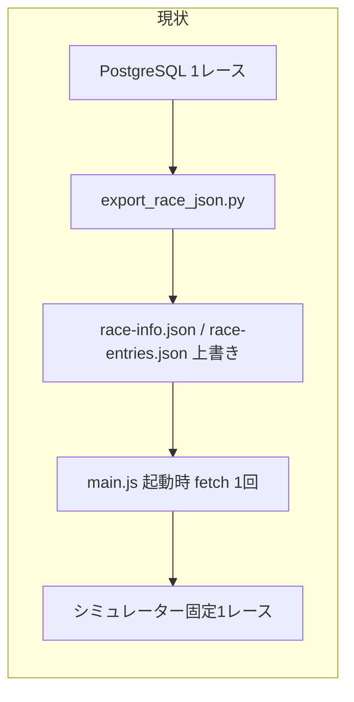
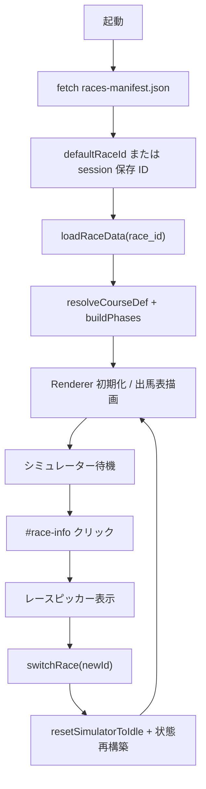

# 週末重賞レース選択機能（アプリ側のみ）

> **保存場所:** `.cursor/plans/週末重賞レース選択機能.plan.md`  
> **将来の実装:** Agent モードで `@週末重賞レース選択機能.plan.md` を参照し「この計画に従って実装してください」と依頼する。プレビュー表示で Build ボタンが出ればそれでも可。

## ゴール

- シミュレーター画面上部の [`#race-info`](index.html) をクリックして、同一週末の重賞レース（最大3〜4件）を選択できる
- 選択に応じて **出走馬・コース・フェーズ・馬場** がシミュレーター全体に反映される
- **PostgreSQL エクスポートスクリプトは改修しない**（既存の1レース出力を手動でコピー・リネームしてデータを増やす）

## 現状の制約（変更が必要な理由）



- [`main.js`](main.js) は起動時に固定2ファイルのみ読み込み（L423-447）
- `#race-info` は表示専用（クリック不可）
- `phases` / `renderer` は `const` で一度だけ生成
- `race_id` は数値（日付のみ）前提で、RNG 生成に `Number(race_id)` を使用（L780）→ 文字列 ID では `NaN` になる
- [`phase-controller.js`](src/ui/phase-controller.js) L736: `race_id + 7919` は文字列 ID だと連結になり RNG が壊れる
- session 復元は `race_id` 一致チェックが不十分（別レースのシミュ結果が混ざる可能性）

## データ設計（手動運用）

エクスポートは従来どおり [`src/data/race-info.json`](src/data/race-info.json) / [`race-entries.json`](src/data/race-entries.json) に上書き出力。重賞を追加するときは **エクスポート後に手動で整理** する。

### ディレクトリ構成（新規）

```
src/data/
  races-manifest.json          # 週末の重賞一覧（G1/G2/G3 のみ手動登録）
  races/
    20260607Tokyo11R/
      race-info.json
      race-entries.json
    20260608Hanshin11R/
      race-info.json
      race-entries.json
  race-info.json               # 互換用デフォルト（manifest の default と同期）
  race-entries.json
```

### `race_id` 形式（ユーザー指定）

- 例: `20260614Hanshin11R` = `YYYYMMDD` + 競馬場略称（PascalCase）+ レース番号 + `R`
- 各 `race-info.json` / `race-entries.json` の `race_id` フィールドをこの文字列に揃える
- フォルダ名と `race_id` を一致させる（運用ミス防止）

### `races-manifest.json`（新規・手動編集）

週末の重賞だけを列挙する（ランタイムで G 判定フィルタはしない。manifest が唯一の選択肢）。

```json
{
  "weekendLabel": "2026年6月7日〜8日週",
  "defaultRaceId": "20260607Tokyo11R",
  "races": [
    {
      "race_id": "20260607Tokyo11R",
      "infoPath": "./races/20260607Tokyo11R/race-info.json",
      "entriesPath": "./races/20260607Tokyo11R/race-entries.json"
    }
  ]
}
```

### 週末切り替え（運用）

- アプリは **manifest に載ったレースだけ** を選択肢として表示する（フォルダを総なめしない）
- 新しい週末になったら `races-manifest.json` の `races` を今週の3〜4件に差し替える
- 先週の `src/data/races/{race_id}/` は削除しても残してもよい（manifest に無ければ無視）
- session に残った前週の `selectedRaceId` は manifest に無い場合 `defaultRaceId` にフォールバック

### 手動データ追加手順（ドキュメント化のみ）

1. DB を対象レースに差し替え → `.venv/bin/python scripts/export_race_json.py` 実行
2. 出力2ファイルを `src/data/races/{race_id}/` へコピー
3. 両 JSON の `race_id` を `20260614Hanshin11R` 形式に書き換え
4. `races-manifest.json` の `races` 配列に1件追加（G1/G2/G3 のみ）
5. `defaultRaceId` とルートの `race-info.json` / `race-entries.json` をデフォルトレースに合わせて更新（既存テスト・fixture 互換）

## アプリ改修の流れ



### ステップ1: レースカタログモジュール（新規）

[`src/lib/race-catalog.js`](src/lib/race-catalog.js) を追加。

| 関数 | 責務 |
|------|------|
| `fetchRaceManifest()` | manifest 読み込み・バリデーション |
| `loadRacePair(infoPath, entriesPath)` | info + entries を fetch、`race_id` 一致チェック |
| `loadRaceById(manifest, raceId)` | 指定レースの `raceData` を組み立て |
| `listSelectableRaces(manifest)` | ピッカー用一覧（3〜4件） |

既存の [`resolveCourseDef`](src/lib/course-resolve.js) はそのまま利用（会場・距離は `race_info` から解決）。

### ステップ2: 文字列 `race_id` 対応（RNG）

[`src/engine/rng.js`](src/engine/rng.js) に `raceIdToSeed(raceId)` を追加（文字列を FNV-1a 等で uint32 に変換）。

修正箇所:

- [`main.js`](main.js) `rollSimulationSeed()` — `Number(race_id)` を `raceIdToSeed(race_id)` に変更
- [`src/ui/phase-controller.js`](src/ui/phase-controller.js) L736 — `createRng(raceIdToSeed(race_id) + 7919)` 相当に変更
- [`src/engine/simulation.js`](src/engine/simulation.js) — `options.seed` 未指定時の既定値生成を `raceIdToSeed` 経由に

既存ゴールデンテストは `race_id` 変更に伴いスナップショット更新が必要（[`tests/simulation.test.js`](tests/simulation.test.js)）。

### ステップ3: レースピッカー UI（新規）

[`src/ui/race-picker.js`](src/ui/race-picker.js) を追加。

- [`#race-info`](index.html) を `<button type="button">` 化（アクセシビリティ: `aria-expanded`, `aria-haspopup`）
- クリックでポップオーバー／ドロップダウンを表示（既存の [`pre-race-info-popover`](src/ui/pre-race-editor.js) スタイルを流用可能）
- 各候補: 日付・競馬場・グレード・レース名（`formatRaceInfo` の要約または manifest + info のメタ）
- 現在選択中をハイライト
- **候補が1件だけのときはピッカー非表示**（従来どおり表示専用）
- レース進行中（`controller` あり or `playbackDockMode === 'complete'`）の切り替え時は確認ダイアログ（オリジナル設定変更時と同様の UX）

CSS は [`index.html`](index.html) 内の `#race-info` 周辺に追加（ボタン見た目・ホバー・フォーカスリング）。

### ステップ4: `main.js` のレース切り替えコア

[`main.js`](main.js) の起動ブロックをリファクタ。

**変数の変更**

- `const phases` / `const renderer` → `let phases`, `let renderer`（または `renderer.configure(...)`）
- `runtimeRaceData`, `baselineRaceEntries`, `courseCatalog` は既存のまま更新可能に

**新規関数 `switchRace(raceId)`**

1. 同一 ID なら何もしない
2. 進行中なら `confirm` で中断確認
3. `resetSimulatorToIdle()` 実行
4. `loadRaceById` で新データ取得 → `resolveCourseDef` → `buildPhases`
5. `Renderer` を再生成、または [`src/ui/renderer.js`](src/ui/renderer.js) に `reconfigure(totalPhases, track, condition, courseDef)` を追加して内部状態を更新
6. `baselineRaceEntries` 更新
7. `carrotsByHorse` / `marksByHorse` を頭数に合わせて再初期化
8. session から同一 `race_id` の bundle があれば 🥕・印を復元（[`aggregate-store.js`](src/stats/aggregate-store.js) の既存ロジックを流用）
9. `applyComputedHorsesToUi()` + オリジナル設定画面が開いていれば `renderPreRaceEditor` も更新
10. 集計バケットが変わる場合は既存の `clearAggregateState` パターンを踏襲（[`handlePreRaceCloseAttempt`](main.js) L1333-1354 参照）

**起動フロー変更**

```javascript
// 現状
Promise.all([race-info.json, race-entries.json, courses.json])

// 変更後
Promise.all([races-manifest.json, courses.json])
  .then → loadRaceById(defaultOrSaved)
```

### ステップ5: session 永続化の拡張

[`src/stats/aggregate-store.js`](src/stats/aggregate-store.js) に以下を追加。

| キー | 用途 |
|------|------|
| `jra-sim-selected-race-v1` | 最後に選択した `race_id` |
| `jra-sim-bundles-v1`（任意） | `race_id` ごとの 🥕・印・脚質 bundle を Map 保存 |

最低限: 選択 `race_id` の保存 + 単一 `STORAGE_KEY_BUNDLE` は「現在レース」用として維持。切り替え前に bundle を Map へ退避、切り替え後に該当レースの bundle を復元。

[`restoreSimulatorStateFromSession`](main.js) / [`persistSimulatorStateToSession`](main.js) の payload に `race_id` を含め、復元時に現在レースと不一致なら復元をスキップ。

### ステップ6: 関連画面の同期

| 画面 | 対応 |
|------|------|
| シミュレーター `#race-info` | ピッカー付き（主 UI） |
| オリジナル設定 `#pre-race-race-info` | `switchRace` 後に `formatRaceInfo` 再描画（選択変更はシミュレーター側からのみでも可） |
| レースサマリー `#summary-race-info` | 切り替え時は `hideRaceSummaryScreen`（`resetSimulatorToIdle` で既に対応） |
| 集計 [`stats-app.js`](src/stats/stats-app.js) | 変更不要（session bundle の `race_id` に追従。レース切替後に集計画面を開けば新レースのバケットになる） |

### ステップ7: テスト・ドキュメント

- [`tests/helpers/load-race-fixture.js`](tests/helpers/load-race-fixture.js) — manifest 経由または従来パスのフォールバック
- 新規: `tests/race-catalog.test.js`（manifest 読み込み・race_id 不一致エラー）
- 新規: `tests/race-id-seed.test.js`（文字列 ID → 安定した uint32 シード）
- [`Development_Instruction.md`](Development_Instruction.md) §4 データ構造・§19 手動追加手順を更新
- エクスポート skill は「アプリ側 multi-race は手動整理」と注記（スクリプト本体は触らない）

## 実装順序（推奨）

1. データ配置 + 現行レースを `20260607Tokyo11R` 形式へ移行（手動・1レースで動作確認）
2. `raceIdToSeed` + RNG 呼び出し修正
3. `race-catalog.js` + 起動時 manifest 読み込み
4. `Renderer.reconfigure`（または再生成）+ `switchRace`
5. レースピッカー UI
6. session 拡張（選択保存・復元ガード）
7. テスト・ドキュメント

## スコープ外（今回やらない）

- [`scripts/export_race_json.py`](scripts/export_race_json.py) / [`scripts/race_export/`](scripts/race_export/) の改修
- 重賞以外のレースの自動収集
- `courses.json` の全会場追加（未登録コースは既存フォールバックで動作。精度向上は別タスク）
- DB から週末分を一括エクスポート

## リスクと対策

| リスク | 対策 |
|--------|------|
| 文字列 `race_id` で既存テスト・集計データが不整合 | マイグレーション時に1レース分を新 ID へ統一し、ゴールデン更新 |
| レース切替中に session 復元が別レースを表示 | `simulator-state` に `race_id` を保存し一致時のみ復元 |
| 同一日複数重賞で旧数値 ID が衝突 | 新 ID 形式を必須とし manifest で明示管理 |
| 頭数変更で 🥕 配列がずれる | `createDefaultCarrotsByHorse(fieldSize)` で毎回再生成 + per-race bundle 復元 |
